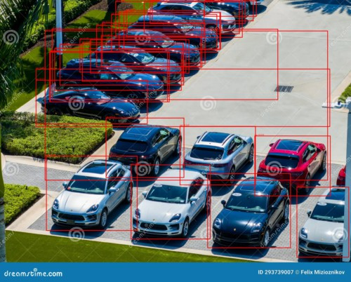
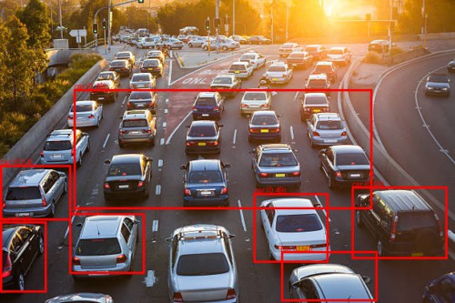
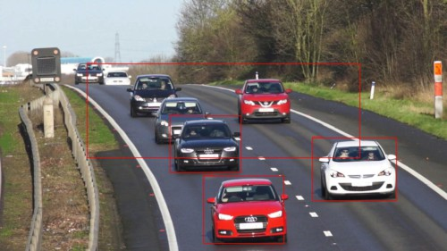

# DeTr Fine-Tuned on Custom Data  

## Introduction  
This project demonstrates the implementation of **DeTr** (Detection Transformer) for object detection. Here the Facebook's DeTr model is fine-tuned on a custom dataset to improve its performance for specific objects.  

## Dataset  
- The dataset was downloaded from **Roboflow** in **COCO format**.  
- Preprocessed and prepared for fine-tuning.  

## Model Fine-Tuning  
- Used **Facebook's DeTr (ResNet-50)** as the base model.  
- Fine-tuned on the custom dataset to adapt to specific object categories.  
- Saved the trained model for inference.  

## Streamlit Inference App  
- A **Streamlit UI** was developed for easy image upload and object detection.  
- Users can upload images, and the model detects the objects from it.  

## Test Results

The model was fine-tuned on a limited dataset with just 5 epochs of training. While the performance can be further improved with more data and training time, the current results demonstrate the potential of DeTr for object detection on custom datasets.
